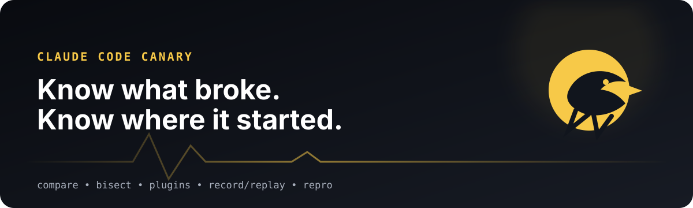

<p align="center">
  
</p>

<p align="center">
  <a href="https://github.com/SLP-DEV1/claude-code-canary/actions/workflows/ci.yml"></a>
  <a href="https://github.com/SLP-DEV1/claude-code-canary/actions/workflows/codeql.yml"></a>
  
  
  <a href="LICENSE"></a>
</p>

<p align="center">
  <a href="#the-30-second-demo">30-second demo</a> ·
  <a href="#github-action">GitHub Action</a> ·
  <a href="docs/PLUGIN_SUITE.md">Plugin suites</a> ·
  <a href="docs/MCP_CONTRACTS.md">MCP contracts</a> ·
  <a href="docs/DISTRIBUTION.md">Distribution</a> ·
  <a href="SECURITY.md">Security</a>
</p>

# Claude Code Canary

**Deterministic regression testing and compatibility intelligence for Claude Code.**

Claude Code changes. Your `CLAUDE.md`, hooks, plugins, MCP servers and permission rules change too. Canary gives you a repeatable answer to the question that normally becomes guesswork:

> **What broke, and which Claude Code release first broke it?**

Canary runs the same scenario from the same Git commit in disposable worktrees, captures tool/token/reported-cost/duration metrics, checks deterministic assertions, compares releases, bisects regressions and builds full plugin compatibility matrices.

## The 30-second demo

Plugin author? Turn your plugin surface into smoke tests, then test every generated scenario across recent Claude Code releases:

```bash
claude-canary plugin-init ./my-plugin
claude-canary plugin-suite --plugin ./my-plugin --last 10
```

You get one report like this:

```text
| Claude Code | load | command-review | skill-api | hook-stop | mcp-github | Overall |
|-------------|:----:|:--------------:|:---------:|:---------:|:----------:|---------|
| 2.1.231     |  ✅  |       ✅       |    ✅     |    ✅     |     ✅     | ✅ Compatible |
| 2.1.232     |  ✅  |       ✅       |    ✅     |    ❌     |     ✅     | ❌ 1 failed |
| 2.1.233     |  ✅  |       ❌       |    ✅     |    ❌     |     ✅     | ❌ 2 failed |
```

Need the exact regression boundary instead?

```bash
claude-canary bisect .canary/plugin-smoke.canary.yml \
  --good 2.1.220 \
  --bad 2.1.237
```

## Why Canary is different

| Problem | Canary |
| --- | --- |
| "The new Claude release feels worse" | Run the same deterministic scenario on both releases. |
| "Which release broke us?" | Binary-search the real published Claude Code release range. |
| "Does this plugin still work?" | Generate smoke tests and run a release × component compatibility suite. |
| "Is my new `CLAUDE.md` actually better?" | Run interleaved A/B configuration experiments. |
| "This worked yesterday" | Record a good real task and replay it from the exact original commit. |
| "How do I report this bug safely?" | Export a bounded, redacted reproduction bundle. |
| "Did agent usage blow up?" | Track tool calls, tokens, duration and reported cost. |
| "Did this PR make the agent worse?" | Compare base vs head with the same Claude executable and fail on configured deltas. |
| "Can CI do this without paying for two runs every time?" | Commit a known-good metric baseline and execute only the candidate. |
| "Did my MCP server silently change?" | Snapshot tools/prompts/resources and fail on removed tools, schema changes or capability regressions. |

Canary is not another transcript viewer or generic model leaderboard. It is a **regression layer for real Claude Code workflows**.

## GitHub Action

The v1 Action supports `compare`, `run`, `pr-check`, `baseline-check`, `plugin-matrix` and `plugin-suite` through one Marketplace-ready `action.yml`. `pr-check` can also update one stable pull-request comment with the regression table when `comment-pr: true` is enabled.

A plugin compatibility gate can be as small as:

```yaml
name: Claude Canary

on:
  workflow_dispatch:
  push:
    branches: [main]

permissions:
  contents: read

jobs:
  plugin-compatibility:
    runs-on: ubuntu-latest
    env:
      ANTHROPIC_API_KEY: ${{ secrets.ANTHROPIC_API_KEY }}
    steps:
      - uses: actions/checkout@v7
        with:
          fetch-depth: 0

      - uses: SLP-DEV1/claude-code-canary@v1
        with:
          mode: plugin-suite
          plugin: ./my-plugin
          last: 10
```

The Action streams progress into the job log, writes the combined Markdown report to the GitHub Step Summary and uploads `.canary/results/` as an artifact. Inputs are converted into a direct argument array rather than interpolated into a shell command.

> **Security:** do not expose `ANTHROPIC_API_KEY` or other secrets to untrusted fork code/scenarios. Prefer trusted branches, `workflow_dispatch`, or carefully designed PR workflows. See [GitHub Action security](docs/GITHUB_ACTION.md#security).

See [docs/GITHUB_ACTION.md](docs/GITHUB_ACTION.md) for every input/output and more examples.

## CLI quick start

Requirements:

- Node.js 20+
- Git
- an authenticated Claude Code installation or API-key environment suitable for headless Claude Code

Install the published CLI from npm:

```bash
npm install -g claude-code-canary

claude-canary --version
claude-canary doctor
```

For repository development, clone this repo and run `npm ci --ignore-scripts && npm run build`.

Then create and run a scenario inside the repository you want to test:

```bash
cd /path/to/project
claude-canary init
claude-canary run .canary/basic.canary.yml
```

## Custom and local model gateways

Canary drives the **Claude Code CLI** rather than calling a model API directly. That means a Claude Code setup that already works through a compatible gateway can normally be exercised by Canary through the same CLI configuration and environment.

A useful preflight check is:

```bash
claude -p "Reply exactly LOCAL_OK"
```

If that command reaches your configured gateway and succeeds, Canary can invoke the same `claude` executable from an isolated worktree:

```bash
claude-canary run .canary/basic.canary.yml
```

A manual end-to-end smoke test has successfully exercised this path on Windows:

```text
Claude Code
  → Claude Code Router
  → llama.cpp
  → Qwen3.8-27B
  → Claude Code Canary
```

This is a community/custom deployment path, not part of Canary's guarantee that historical **Claude Code releases** behave identically across third-party gateways. Proxy translation, model behavior and gateway routing can add their own sources of variance.

Canary labels `total_cost_usd` as **reported cost**. With a proxy or local model, that value may be estimated, synthetic or otherwise unrelated to actual billing. Treat it as upstream accounting metadata unless your provider explicitly documents it as billable cost.

## Core workflows

### Check an MCP server contract

Inspect a stdio MCP server directly, without invoking a model:

```bash
claude-canary mcp-snapshot .canary/mcp/github.mcp.yml
# review + commit the generated baseline
claude-canary mcp-check .canary/mcp/github.mcp.yml --require-baseline
```

Canary snapshots tools and JSON Schemas, prompts, resources, resource templates, capabilities and observed `list_changed` signals. Removed tools, schema changes and disabled capabilities are breaking by default; additions are reported without failing CI. Tool safety annotations can also be asserted without executing the tool. See [MCP contract testing](docs/MCP_CONTRACTS.md).

### Gate a pull request

Run the same scenario against the base and head Git refs with one Claude executable:

```bash
claude-canary pr-check .canary/basic.canary.yml \
  --base origin/main \
  --head HEAD
```

This catches repository changes that keep the final task green but increase tokens/cost/tool calls, introduce permission prompts, or change configured hook semantics. See [Pull request regression checks](docs/PR_CHECKS.md).

### Check a committed baseline with one Claude run

```bash
claude-canary baseline update .canary/basic.canary.yml
# commit .canary/baselines/<scenario-name>.json
claude-canary baseline check .canary/basic.canary.yml
```

Baselines use the same regression thresholds while cutting recurring CI from two Claude runs to one. A SHA-256 of the scenario prevents stale snapshots from silently passing after the scenario changes. See [Committed baselines](docs/BASELINES.md).
### Compare two Claude Code releases

```bash
claude-canary compare .canary/basic.canary.yml \
  --from 2.1.220 \
  --to latest
```

Canary keeps historical native binaries in its own cache and never replaces your normal `claude` installation. Release manifests are checksum-verified; signed manifests are signature-verified where Anthropic publishes signatures.

`compare` can also fail on **relative regressions even when both releases still produce the correct result**: token growth, reported-cost growth, extra tool calls, new permission prompts/denials, or a changed hook sequence. See [Efficiency and lifecycle regressions](docs/REGRESSION_SEMANTICS.md).

### Find the first bad release

```bash
claude-canary bisect .canary/basic.canary.yml \
  --good 2.1.220 \
  --bad 2.1.237
```

Only the releases needed by binary search are executed. Like `git bisect`, this assumes a monotonic good → bad transition.

### Generate plugin smoke tests

```bash
claude-canary plugin-init ./my-plugin
```

Canary discovers standard and manifest-defined plugin surfaces including:

- commands
- agents
- skills
- hooks
- MCP servers

Generated suites are marker-protected, symlink-safe and intentionally reviewable. They are scaffolds: strengthen assertions for domain-specific behavior before treating them as proof.

### Run the complete plugin suite

```bash
claude-canary plugin-suite \
  --plugin ./my-plugin \
  --last 10
```

The suite refuses stale discovery metadata and missing generated scenarios so an old or accidentally incomplete suite cannot silently turn green. A default run budget prevents accidental `scenarios × releases` explosions.

### Focus on one plugin contract

```bash
claude-canary plugin-matrix \
  .canary/plugins/my-plugin/command-review.canary.yml \
  --plugin ./my-plugin \
  --from 2.1.220 \
  --to 2.1.237
```

Use `plugin-suite` for the broad gate and `plugin-matrix` for focused debugging.

### A/B test Claude configuration

```bash
claude-canary experiment .canary/basic.canary.yml \
  --baseline-config .canary/variants/current \
  --candidate-config .canary/variants/candidate \
  --runs 5
```

Variants can cover project instructions, settings, rules, hooks, MCP config and local plugins. Canary interleaves baseline/candidate runs and reports pass-rate and efficiency deltas. Variant trees containing symlinks are refused.

### Record and replay a real successful task

```bash
claude-canary record auth-fix \
  --prompt "Fix the failing authentication test without changing the public API" \
  --setup "npm ci" \
  --verify "npm test"

# Run the real Claude task, then:
claude-canary save auth-fix

# Later:
claude-canary replay .canary/auth-fix.canary.yml
```

The generated scenario records the exact starting Git commit and deterministic changed-file expectations without persisting raw environment values or a Claude transcript.

### Export a reproduction bundle

```bash
claude-canary repro .canary/results/failed.json
```

Repro bundles use bounded fixture selection, deny credential/build/cache paths, refuse symlinks and binaries, redact common secret/path patterns and generate Linux/macOS plus PowerShell launchers. **Review every bundle before publishing it.** Generic redaction cannot understand project-specific confidentiality.

## Scenario format

```yaml
version: 1
name: fix-auth-regression

prompt: |
  Fix the failing authentication test.
  Do not change the public API.

setup:
  commands:
    - npm ci

claude:
  executable: claude
  permission_mode: dontAsk
  timeout_seconds: 900

verify:
  commands:
    - npm test

expect:
  changed_files:
    allow:
      - src/auth/**
      - test/auth/**
    require:
      - src/auth/**
    deny:
      - package-lock.json
  file_contains:
    - path: src/auth/index.ts
      text: authenticate
  permissions:
    max_prompts: 0
    max_denied: 0
  hooks:
    sequence:
      - PreToolUse
      - PostToolUse

limits:
  max_tool_calls: 100
  max_total_tokens: 200000
  max_cost_usd: 5

regressions:
  max_total_tokens_increase_pct: 25
  max_reported_cost_increase_pct: 20
  max_tool_calls_increase_pct: 25
  max_permission_prompts_increase: 0
  require_same_hook_sequence: true
```

A run passes only when Claude exits successfully **and** every configured deterministic assertion/limit can be evaluated and passes. v1 fails closed on malformed/truncated `stream-json` and on cost limits when Claude does not report cost.

## Isolation and trust model

Every ordinary run starts from a clean tracked repository state and executes in a disposable detached Git worktree. Canary separates generated results from the tested worktree and cleans temporary worktrees/runtime copies after execution.

Additional v1 hardening includes:

- bounded subprocess output capture;
- fail-closed malformed protocol handling;
- validated Claude release platform IDs;
- bounded release downloads plus checksum/signature verification;
- symlink refusal for plugin suites and configuration variants;
- marker-protected destructive regeneration/repro operations;
- exact direct dependency versions plus a committed lockfile;
- SHA-pinned third-party Actions;
- CodeQL and cross-platform CI.

Canary scenarios themselves can contain setup/verification shell commands and Claude permission options. Treat scenario/config files as **trusted code**, especially in CI with credentials.

Read [docs/SECURITY_MODEL.md](docs/SECURITY_MODEL.md) and [SECURITY.md](SECURITY.md) before using Canary on untrusted contributions.

## v1 programmatic API

v1 also exposes a supported ESM library entry point:

```js
import {
  loadScenario,
  runScenario,
  runPluginSuite,
  formatPluginSuiteMarkdown,
  CANARY_VERSION,
} from 'claude-code-canary';
```

The public entry point is `dist/api.js` / `dist/api.d.ts`. Internal files are intentionally not package exports. The core run artifact contract is documented by [`schemas/run-result.schema.json`](schemas/run-result.schema.json).

## Commands

```text
init             Create a starter scenario
validate         Validate scenario YAML without spending tokens
run              Run one deterministic scenario
compare          Compare two executables or releases
pr-check         Compare one Claude executable across two Git refs
baseline         Create/check committed known-good metric baselines
bisect           Find the first bad executable/release
experiment       A/B test Claude Code configuration variants
record / save    Capture a successful real task as a scenario
replay           Replay from the recorded starting commit
repro            Create a privacy-first bug reproduction bundle
plugin-init      Discover a plugin and generate smoke scenarios
plugin-matrix    Test one plugin scenario across releases
plugin-suite     Test the complete generated plugin surface across releases
versions         Install/list/locate isolated Claude Code releases
doctor           Check local prerequisites and repository readiness
```

Run `claude-canary <command> --help` for command-specific flags.

## Documentation

| Guide | What it covers |
| --- | --- |
| [GitHub Action](docs/GITHUB_ACTION.md) | Marketplace usage, modes, inputs, outputs and CI security |
| [Pull request checks](docs/PR_CHECKS.md) | Base-vs-head regression gates and optional stable PR comments |
| [Committed baselines](docs/BASELINES.md) | One-run CI against reviewed known-good metrics |
| [Plugin suites](docs/PLUGIN_SUITE.md) | Full release × plugin-surface matrices |
| [Plugin smoke generator](docs/PLUGIN_SMOKE_GENERATOR.md) | Discovery rules and generated scenarios |
| [Plugin compatibility](docs/PLUGIN_COMPATIBILITY.md) | Focused plugin matrices and isolation |
| [Version manager](docs/VERSION_MANAGER.md) | Release cache, checksums and signature trust |
| [Efficiency & lifecycle regressions](docs/REGRESSION_SEMANTICS.md) | Relative token/cost/tool regressions, permission prompts and ordered hooks |
| [Configuration experiments](docs/CONFIG_EXPERIMENTS.md) | A/B test layout and interpretation |
| [Record & replay](docs/RECORD_REPLAY.md) | Recording workflow and privacy model |
| [Reproduction bundles](docs/REPRO_BUNDLES.md) | Safe bundle generation and publishing checklist |
| [Security model](docs/SECURITY_MODEL.md) | Trust boundaries and threat model |
| [Reproducibility](docs/REPRODUCIBILITY.md) | Determinism guarantees and unavoidable variance |
| [Releasing](docs/RELEASING.md) | v1 tags, Marketplace and release checklist |
| [Distribution](docs/DISTRIBUTION.md) | npm, Marketplace and curated-list publication checklist |
| [Roadmap](docs/ROADMAP.md) | What is shipped and what comes next |

## Contributing

Bug reports, focused feature proposals and compatibility fixtures are welcome. Please run:

```bash
npm ci --ignore-scripts
npm run check
```

before opening a PR. See [CONTRIBUTING.md](CONTRIBUTING.md).

## Project status

Current package version: **v1.1.0**. The **v1.0.0** contract froze scenario `version: 1`, core run result `schemaVersion: 1`, the public package entry point and the documented CLI command names. Future incompatible schema changes must use an explicit new schema version and migration path rather than silently reinterpreting v1 data.

## License

MIT. See [LICENSE](LICENSE).

Claude and Claude Code are products/trademarks of Anthropic. Claude Code Canary is an independent open-source project and is not affiliated with or endorsed by Anthropic.
